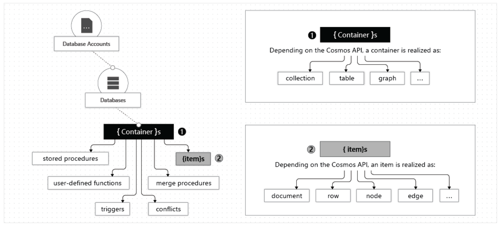
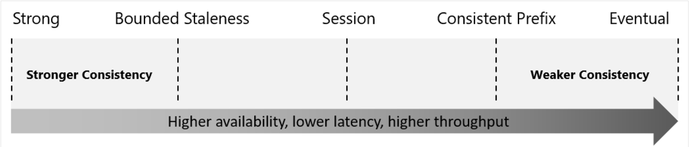
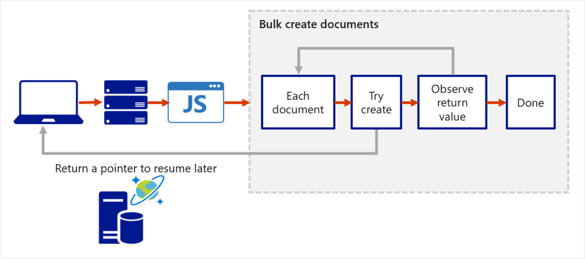

# Azure Cosmos DB

- Is a globally distributed database system that allows you to read and write data from the local replicas of your database and it transparently replicates the data to all regions associated with your Cosmos account.
- Fully managed NoSQL database designed to provide low latency, elastic scalability of throughput, well-defined semantics for data consistency, and high availability.
- You can configure your DBs to be globally distributed and available in any of the Azure regions.
- With Azure Cosmos DB you can add or remove regions associated with your account at any time without stopping your application.
- Key benefits of global distribution:
  - Uses the multi-master replication protocol, every region supports read and write.
  - The multi-master capability also enables:
    - Unlimited elastic write and read scalability
    - 99.999% read and write availability all around the world. (5m 13s downtime yearly)
    - Guaranteed reads and writes served in less than 10ms at the 99th percentile.
- Cosmos internally handles the data replication between regions with consistency level guarantees of the level you selected.

## The Resource Hierarchy

- Your Azure Cosmos DB account contains a unique DNS name and you can manage an account by using the Azure Portal or Azure CLI, or SDKs.
- Elements in an Azure Cosmos DB account:
  - A container is the fundamental unit of scalability, you can virtually have an unlimited provisioned throughput (RU/s) and storage on a container.
  - Azure Cosmos DB transparently partitions your container using the logical partition key that you specify in order to elastically scale your provisioned throughput and storage.
  - You can create a max of 50 Azure Cosmos DB accounts under an Azure subscription (can be increase via a support request).



### Databases

- You can create one or multiple Azure Cosmos DB databases under your account.
- A database is analogous to a namespace.
- A database is the unit of management for a set of Azure Cosmos DB containers.

### Containers

- Is where data is stored.
- Azure Cosmos DB scales out.
- Data is stored on one or more servers called _partitions_.
  - To increase partitions, you increase throughput, or they grow automatically as storage increases.
  - The relationship provides a virtually unlimited amount of throughput and storage for a container.
- When creating a container you need to supply a partition key, which is a property that you select form your items to help Azure Cosmos DB distribute the data efficiently across partitions.
- Cosmos uses this value to route data to the appropriate partition to be written, updated or deleted.
- The underlying storage mechanism for data in Cosmos is called a _physical partition_, which have a throughput amount of up to 10,000 Request Units per second, and can store up to 50GB of data.
  - Cosmos abstracts this partitioning concept with a logical partition which can store up to 20GB of data.
- When you create a container, you configure throughput in one of the following modes:
  - **Dedicated throughput**: The throughput on a container is exclusively reserved for that container. There are 2 types of dedicated throughput: standard and autoscale.
  - **Shared throughput**: Throughput is specified at the database level and then shared with up to 25 containers within the database. Sharing of throughput excludes containers that are configured with their own dedicated throughput.

### Items

- Depending on which API you use, individual data entities can be represented in various ways:

| Azure Cosmos DB enitty | API for NoSQL | API for Cassandra | API for MongoDB | API for Gremlin | API for Table |
| :--------------------- | :------------ | :---------------- | :-------------- | :-------------- | :------------ |
| Azure Cosmos DB Item   | Item          | Row               | Document        | Node or edge    | Item          |

## Consistency Levels

- Offers 5 levels, from strongest to weakest:
  - Strong
  - Bounded staleness
  - Session
  - Consistent prefix
  - Eventual
- Each level provides availability and performance trade-offs.
- The levels are region-agnostic and are guaranteed for all operations, regardless of the region where the reads and writes are served, the number of regions associated with your Cosmos Azure Cosmos DB account, or whether your account is configured with a single or multiple write regions.



### Choosing the Right Consistency Level

- Configure the default consistency level.
  - Applies to all Azure Cosmos DB databases and containers under that account.
  - All reads and queries issued against a container or a database use the specified consistency level by default.
  - Read consistency applies to a single read operation scoped within a logical partition.
  - The read operation can be issued by a remote client or a stored procedure.
- Guarantees associated with consistency levels:
  - **Strong consistency**: Users are always guaranteed to read the latest committed write.
  - **Bounded staleness consistency**: the lag of data between any 2 regions is always less than a specified amount.
    - When you choose bounded staleness, the maximum staleness of the data in any region can be configured in 2 ways:
      - The number of versions (K) of the item.
      - The time interval (T) reads might lag behind the writes.
  - **Session consistency**: reads are guaranteed to honour the read-your-writes, and write-follows-reads guarantees, this guarantee assumes a single "writer" session or sharing the session token for multiple writers.
  - **Consistent prefix consistency**: updates made as single document writes sees eventual consistency, and updates made as a batch within a transaction are returned consistent to the transaction in which they were committed.
    - Assume 2 write operations are performed on documents Doc1 and Doc2, within transactions T1 and T2.
    - When client does a read in any replica, the user sees either "Doc1 v1" and "Doc2 v1" or "Doc1 v2" and "Doc2 v2", but never "Doc1 v1" and "Doc2 v2" or "Doc1 v2" and "Doc2 v1" for the same read or query operation.
  - **Eventual Consistency**: There's no ordering guarantee for reads and in the absence of any further writes, the replicas eventually converge.
    - It is the weakest form of consistency because a client might read the values that are older than the ones it read before.
    - It is ideal where the application doesn't require any ordering guarantees.

## Supported APIs

- **NoSQL**
  - Stores data in document format.
  - Best end-to-end experience.
  - Full control over the interface, service, and SDK client libraries.
  - Provide support for querying items using the Structured Query Language (SQL) syntax.
- **MongoDB**
  - Stores data in a document structure via BSON format.
  - Compatible with MongoDB wire protocol; however it doesn't use any native MongoDB related code.
  - Great choice if you want to use the broader MongoDB ecosystem and skills, without compromising on using Azure Cosmos DB features.
- **PostgreSQL**
  - Stores data either on a single node, or distributed in a multi-node configuration.
  - Managed service for running PostgreSQL at any scale, with the Citus open source superpower of distributed tables.
- **Cassandra**
  - Stores data in column-orientated schema.
  - Offers a highly distributed, horizontally scaling approach to storing large volumes of data while offering a flexible approach to a column-orientated schema.
  - Is wire protocol compatible with native Apache Cassandra.
- **Gremlin**
  - Allows users to make graph queries and stores data as edges and vertices.
  - Use for scenarios:
    - Involving dynamic data
    - Involving data with complex relations
    - Involving data that is too complex to be modelled with relational databases
    - If you want to use the existing Gremlin ecosystem and skills
- **Table**
  - Stores data in key/value format
  - Recommendation is to migrate your app if you want to use the benefits of Azure Cosmos DB.
  - Only supports OLTP scenarios

These APIs allow us to model real world data using documents, key-value, graph, and column-family data models. All the APIs offer automatic scaling of storage and throughput, flexibility, and performance guarantees.

### Considerations when choosing API

- API for NoSQL is native to Azure Cosmos DB.
- API for all the others listed implement the wire protocol of open-source database engines, best suited for:
  - If you have existing MongoDB, PostgreSQL, Cassandra, or Gremlin applications.
  - If you don't want to rewrite your entire data access layer.
  - If you want to use the open-source developer ecosystem, client-drivers, expertise, and resources for your database.

## Request Units (RUs)

- A unit to provision throughput and storage you consume on an hourly basis.
- A RU represents the system resources such as CPU, IOPS, and memory that are required to perform the database operations supported by Azure Cosmos DB.
- Eg. The cost to do a point read, which is fetching a single item by its ID and partition key value, for a 1-KB item is 1RU.
- The type of Azure Cosmos DB account you're using determines the way consumed RUs get charged.
- 3 modes:
  - **Provisioned throughput mode**: per-second basis in increments of 100RUs per second.
    - You can increment or decrement the number of RUs anytime in 100RU increments.
  - **Serverless mode**: at the end of the billing period, you get billed for the number of RUs that have been consumed in your DB operations.
  - **Autoscale mode**: automatically and instantly scale thr throughput (RU/s) of our database or container based on usage.
    - Well-suited for mission-critical workloads that have variable or unpredictable traffic patterns, and require SLAs on high performance and scale.

## Microsoft .NET SDK v3

- [Useful examples](https://learn.microsoft.com/en-us/azure/cosmos-db/sql-api-dotnet-v3sdk-samples)

### CosmosClient

Create a thread-safe `CosmosClient` with a connection string, the goal is to maintain a single instance of `CosmosClient` per lifetime of the application that enables efficient connections management and performance.

```cs
CosmosClient client = new CosmosClient(endpoint, key);
```

### Database Examples

Create an instance of a database class referencing a server-side database. The method used throws an exception if a database with the same name already exists.

```cs
// New instance of Database class referencing the server-side database
Database database1 = await client.CreateDatabaseAsync(
    id: "adventureworks-1"
);
```

Read a Database by ID

```cs
DatabaseResponse readResponse = await database.ReadAsync();
```

Delete a Database

```cs
await database.DeleteAsync();
```

### Container Examples

Create a container, only the container ID is used to check whether or not the container already exists.

```cs
// Set throughput to the minimum value of 400 RU/s
ContainerResponse simpleContainer = await database.CreateContainerIfNotExistsAsync(
    id: containerId,
    partitionKeyPath: partitionKey,
    throughput: 400);
```

Get a container by ID

```cs
Container container = database.GetContainer(containerId);
ContainerProperties containerProperties = await container.ReadContainerAsync();
```

Delete a container

```cs
await database.GetContainer(containerId).DeleteContainerAsync();
```

### Item Examples

Create an Item

```cs
ItemResponse<SalesOrder> response = await container.CreateItemAsync(salesOrder, new PartitionKey(salesOrder.AccountNumber));
```

Read an Item

```cs
string id = "[id]";
string accountNumber = "[partition-key]";
ItemResponse<SalesOrder> response = await container.ReadItemAsync(id, new PartitionKey(accountNumber));
```

Query an Item

```cs
QueryDefinition query = new QueryDefinition(
    "select * from sales s where s.AccountNumber = @AccountInput ")
    .WithParameter("@AccountInput", "Account1");

FeedIterator<SalesOrder> resultSet = container.GetItemQueryIterator<SalesOrder>(
    query,
    requestOptions: new QueryRequestOptions()
    {
        PartitionKey = new PartitionKey("Account1"),
        MaxItemCount = 1
    });
```

## Stored Procedures

- Cosmos DB provides language-integrated, transactional execution of JavaScript that lets you write stored procedures, triggers, and user-defined functions (UDFs).
- In order to call any of these, you need to first register it.
- A stored procedure can create, update, read, query, and delete items inside an Azure Cosmos container.
- Registered per collection, and can operate on any document or an attachment present in that collection.
- Simple Example: Returns a "Hello World" response

```js
const helloWorldStoredProc = {
  id: "helloWorld",
  serverScript: function () {
    const context = getContext();
    const response = context.getResponse();

    response.setBody("Hello, World");
  },
};
```

- The `context` object provides access to all operations that can be performed in Azure Cosmos DB, and access to the request and response objects.
- Example: Creating an Item
  - The item will be inserted into the Azure Cosmos DB container and an ID for the newly created Item is returned.
  - The callback has 2 parameters: the error object in case of failure and a return value.
  - The stored procedure includes a parameter to set the description as a boolean value, if this set to true and description is missing, the stored procedure will throw an exception.

```js
const createDocumentStoredProc = {
  id: "createMyDocument",
  body: function createMyDocument(documentToCreate) {
    const context = getContext();
    const collection = context.getCollection();
    const accepted = collection.createDocument(
      collection.getSelfLink(),
      documentToCreate,
      function (err, documentCreated) {
        if (err) throw new Error("Error" + err.message);
        context.getResponse().setBody(documentCreated.id);
      }
    );
    if (!accepted) return;
  },
};
```

- Input parameters are always sent as a string to the stored procedure, you can use `JSON.parse()` to convert the string to an array if that is what you want.
- All Azure Cosmos DB operations must complete within a time limit.
- All collection functions return a Boolean that represents whether that operation completes or not.
- You can implement **transactions on items** within a container by using a stored procedure.
  - JavaScript functions can implement a continuation-based model to batch or resume execution.
  - The continuation value can be any value and your applications can use this value to resume a transaction from a new starting point.
  - Below is an example of how the transaction continuation model can be used to repeat a server-side function until the function finishes its entire processing workload.



## Triggers

- **Pre-triggers** are executed before modifying a database item.
- **Post-triggers** are executed after modifying a database item.
- Triggers aren't automatically executed, they have to be specified for each database operation where you want them to execute.
- After defining a trigger, you should register it.
- [Examples](https://learn.microsoft.com/en-us/azure/cosmos-db/nosql/how-to-use-stored-procedures-triggers-udfs?tabs=dotnet-sdk-v2#pre-triggers)
- Pre-trigger Example: Validate properties of an Azure Cosmos item that is being created.
  - It adds a timestamp property to a newly added item if it doesn't contain one.
  - Pre-triggers can't have any input parameters.
  - The request object in the trigger is used to manipulate the request message associated with the operation.
  - When triggers are registered, you can specify the operations that it can run with.
  - This trigger should be created with a `TriggerOperation` value of `TriggerOperation.Create`.
  - Using the trigger in a replace operation isn't permitted.

```cs
function validateToDoItemTimestamp() {
    var context = getContext();
    var request = context.getRequest();

    // item to be created in the current operation
    var itemToCreate = request.getBody();

    // validate properties
    if (!("timestamp" in itemToCreate)) {
        var ts = new Date();
        itemToCreate["timestamp"] = ts.getTime();
    }

    // update the item that will be created
    request.setBody(itemToCreate);
}
```

- Post-trigger Example: Queries for the metadata item and updates it with details about the newly created item.
  - The post-trigger runs as part of the same transaction for the underlying item itself.
  - An exception during the post-trigger execution fails the whole transaction.
  - Anything committed is rolled back and and an exception returned.

```cs
function updateMetadata() {
var context = getContext();
var container = context.getCollection();
var response = context.getResponse();

// item that was created
var createdItem = response.getBody();

// query for metadata document
var filterQuery = 'SELECT * FROM root r WHERE r.id = "_metadata"';
var accept = container.queryDocuments(container.getSelfLink(), filterQuery,
    updateMetadataCallback);
if(!accept) throw "Unable to update metadata, abort";

function updateMetadataCallback(err, items, responseOptions) {
    if(err) throw new Error("Error" + err.message);
        if(items.length != 1) throw 'Unable to find metadata document';

        var metadataItem = items[0];

        // update metadata
        metadataItem.createdItems += 1;
        metadataItem.createdNames += " " + createdItem.id;
        var accept = container.replaceDocument(metadataItem._self,
            metadataItem, function(err, itemReplaced) {
                    if(err) throw "Unable to update metadata, abort";
            });
        if(!accept) throw "Unable to update metadata, abort";
        return;
    }
}
```

## User-defined Functions

Example: Creates a UDF to calculate income tax for various brackets.  
Assume there is a container called _Incomes_ with properties as follows:

```json
{
  "name": "User One",
  "country": "USA",
  "income": 70000
}
```

```js
function tax(income) {
  if (income == undefined) throw "no input";

  if (income < 1000) return income * 0.1;
  else if (income < 10000) return income * 0.2;
  else return income * 0.4;
}
```

## Change Feed

- Change feed in Azure Cosmos DB is a persistent record of changes to a container in the order they occur,
- It works by listening to an Azure Cosmos DB container for any changes and then outputs the sorted list of documents that were changed in the order in which they were modified.
- The persisted changes can be processed asynchronously and incrementally, and the output can be distributed across one or more consumers for parallel processing.
- You can't filter the change feed for specific operations.
- Change feed currently doesn't log delete operations, you can workaround this by adding a soft marker on the items that are being deleted.
  - You would add a boolean delete attribute on the item and set it true.
  - You would then set a time-to-live (TTL) value on the item, ensuring that it is automatically deleted.
- **Reading the change feed** can either be done via a push or a pull model.
  - A push model (recommended) involves the change feed processor pushing work to a client that has business logic for processing the work.
  - A pull model involves the client pulling work from the server, in this case the client has business logic for processing the work and also stores state for the last processed work. The client also has to handle load balancing across multiple clients processing work in parallel, and handling errors.
- Most of the time you'd use the push model. You'd only opt for the pull model when you want the extra low level control:
  - Reading changes from a particular partition key.
  - Controlling the pace at which your client receives changes for processing.
  - Doing a one-time read of the existing data in the change feed (e.g. to do a data migration).

### Push Model

- 2 ways to read from the change feed with this model:
  - Azure Functions.
  - Change feed processor.
- **Azure Functions**:
  - You can create small reactive Azure Functions that are automatically triggered on each new event in your Azure Cosmos DB container's change feed.
  - With the Azure Functions trigger for Azure Cosmos DB, you can use the Change Feed Processor's scaling and reliable event detection functionality without the need to maintain any worker infrastructure.
- **Change feed processor**:
  - It simplifies the process of reading the change feed and distributes the event processing across multiple consumers effectively.
  - There are 4 main components of implementing the change feed processor:
    1. **The monitored container** has the data from which the change feed is generated. Any inserts and updates to the monitored container are reflected in the change feed of the container.
    2. **The lease container** acts as a state storage and coordinates processing the change feed across multiple workers. It can be stored in the same account as the monitored container or in a separate account.
    3. **The compute instance** hosts the change feed processor to listen for changes. Depending on the platform, it might be represented by a VM, a kubernetes pod, an Azure App Service instance, an actual physical machine. It has a unique identifier referenced as the instance name throughout this article.
    4. **The delegate** is the code that defines what you, the developer, want to do with each batch of changes that the change feed processor reads.
  - When implementing the change feed processor the point of entry is always the monitored container, from a `Container` instance you call `GetChangeFeedProcessorBuilder`:

```cs
/// <summary>
/// Start the Change Feed Processor to listen for changes and process them with the HandleChangesAsync implementation.
/// </summary>
private static async Task<ChangeFeedProcessor> StartChangeFeedProcessorAsync(
    CosmosClient cosmosClient,
    IConfiguration configuration)
{
    string databaseName = configuration["SourceDatabaseName"];
    string sourceContainerName = configuration["SourceContainerName"];
    string leaseContainerName = configuration["LeasesContainerName"];

    Container leaseContainer = cosmosClient.GetContainer(databaseName, leaseContainerName);
    ChangeFeedProcessor changeFeedProcessor = cosmosClient.GetContainer(databaseName, sourceContainerName)
        .GetChangeFeedProcessorBuilder<ToDoItem>(processorName: "changeFeedSample", onChangesDelegate: HandleChangesAsync)
            .WithInstanceName("consoleHost")
            .WithLeaseContainer(leaseContainer)
            .Build();

    Console.WriteLine("Starting Change Feed Processor...");
    await changeFeedProcessor.StartAsync();
    Console.WriteLine("Change Feed Processor started.");
    return changeFeedProcessor;
}
```

- A delegate example:

```cs
/// <summary>
/// The delegate receives batches of changes as they are generated in the change feed and can process them.
/// </summary>
static async Task HandleChangesAsync(
    ChangeFeedProcessorContext context,
    IReadOnlyCollection<ToDoItem> changes,
    CancellationToken cancellationToken)
{
    Console.WriteLine($"Started handling changes for lease {context.LeaseToken}...");
    Console.WriteLine($"Change Feed request consumed {context.Headers.RequestCharge} RU.");
    // SessionToken if needed to enforce Session consistency on another client instance
    Console.WriteLine($"SessionToken ${context.Headers.Session}");

    // We may want to track any operation's Diagnostics that took longer than some threshold
    if (context.Diagnostics.GetClientElapsedTime() > TimeSpan.FromSeconds(1))
    {
        Console.WriteLine($"Change Feed request took longer than expected. Diagnostics:" + context.Diagnostics.ToString());
    }

    foreach (ToDoItem item in changes)
    {
        Console.WriteLine($"Detected operation for item with id {item.id}, created at {item.creationTime}.");
        // Simulate some asynchronous operation
        await Task.Delay(10);
    }

    Console.WriteLine("Finished handling changes.");
}
```

The normal lifecycle of a host instance is:

1. Read the change feed.
2. If there are no changes, sleep for a predefined amount of time (customizable with `withPollInterval` in the `Builder`) and go to #1.
3. If there are changes, send them to the delegate.
4. When the delegate finishes processing the changes successfully, update the lease store with the latest processed point in time and go to #1.

---

[Return](../)
