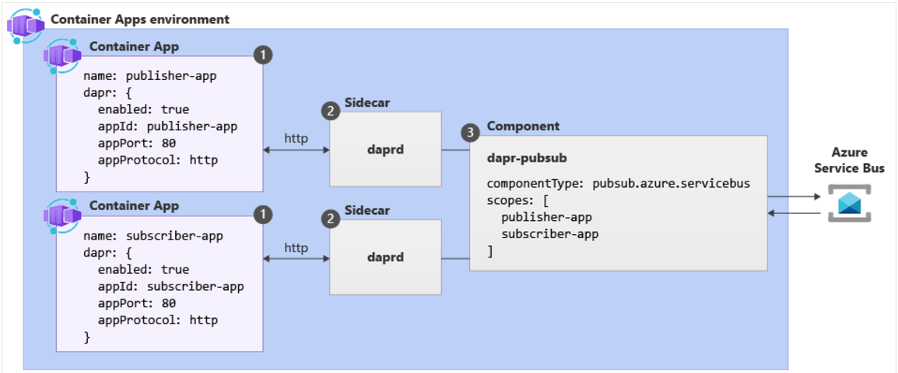

# Containerized Solutions

- **Azure Container Registry (ACR)** is a managed Docker registry service based on the open-source Docker Registry 2.0.
  - Allowing you to create and maintain Azure container registries to store and manage your private Docker container images.
  - You can use the ACR service with existing container development and deployment pipelines, or use ACR Tasks to build container images in Azure.
  - Build on demand, or fully automate builds with triggers such as source code commits and base image updates.
- Use Cases:
  - Pull images from ACR to various deployment targets:
    - **Scalable orchestration systems** that manage containerized applications across clusters of hosts, including Kubernetes, DC/OS, and Docker Swarm.
    - **Azure services** that support building and running applications at scale, including Azure Kubernetes Service (AKS), App Service, Batch, and Service Fabric.
  - Developers can push to a container registry as part of a container development workflow.
  - Configure ACR Tasks to automatically rebuild application images when their base images are update, or automate image builds when your team commits code to a Git repository.
  - Create multi-step tasks to automate building, testing, and patching multiple container images in parallel in the cloud.
- When an image is stored in a repository, each image is a read-only snapshot of a Docker-compatible container.
- Azure container registries can include both Windows and Linux images.
- Use ACR to streamline building, testing, pushing, and deploying images in Azure.
- Configure build tasks to automate your container OS and framework patching pipeline, and build images automatically when your team commits code to source control.

## ACR Service Tiers

| Tier     | Description                                                                                                                                                                                                                                                                                                                       |
| :------- | :-------------------------------------------------------------------------------------------------------------------------------------------------------------------------------------------------------------------------------------------------------------------------------------------------------------------------------- |
| Basic    | Cost-optimised entry point for devs learning about ACR. Basic registries have same programmatic capabilities as Standard and Premium but the included storage and image throughput are most appropriate for lower usage scenarios.                                                                                                |
| Standard | Offer the same capabilities as Basic with increased included storage and image throughput. Standard registries should satisfy the needs of most production scenarios.                                                                                                                                                             |
| Premium  | Provide the highest amount of included storage and concurrent operations, enabling high-volume scenarios. It also adds features such as: geo-replication for managing a single registry across multiple regions, content trust for image tag signing, and private link with private endpoints to restrict access to the registry. |

## Storage Capabilities

- **Encryption-at-rest**
  - All container images and other artifacts in your registry are encrypted at rest.
  - Images are automatically encrypted before they are stored, and are decrypted on the fly when they are pulled out.
  - You can optionally apply an extra encryption layer with a customer-managed key.
- **Regional storage**
  - ACR stores data in the region where the registry is created, to help customers meet data residency and compliance requirements.
  - All regions (except Brazil South and Southeast Asia) Azure might also store registry data in a paired region in the same geography.
  - In Brazil South and Southeast Asia, registry data is always confined to the region, to accommodate data residency requirements for those regions.
  - In the case of a regional outage, the registry data may become unavailable and isn't automatically recovered.
  - If you want better performance and/or resiliency in the case of a regional outage event, you should enable geo-replication.
- **Geo-replication**
  - Premium tier feature.
  - Best for scenarios requiring high-availability assurance.
  - Helps guard against losing access to your registry in a regional failure event.
  - Also provides network-close image storage for faster pushes and pulls in distributed development or deployment scenarios.
- **Zone redundancy**
  - Premium service tier feature.
  - Uses Azure availability zones to replicate your registry to a minimum of 3 separate zones in each enabled region.
- **Scalable storage**
  - ACR allows you to create as many repos, images, layers, or tags as you need, up to the registry storage limit.
  - High numbers can impact performance, so periodically deleting unused repos, images, or tags as part of your registry maintenance can be a help.
  - Note that deleted registry resources like repos, image and tags can't be recovered after deletion.

## Tasks

- Every task has an associated **source code context**.
  - The location of a set of source files used to build a container image or other artifact.
- By default, ACR Tasks build images for the Linux OS and the amd64 architecture.
  - Specify the `--platform` tag to build Windows images or Linux images for other architectures.

| OS      | Architecture           |
| :------ | :--------------------- |
| Linux   | AMD64, Arm, Arm64, 386 |
| Windows | AMD64                  |

### Quick Task

- Build and push a single container image to a container registry on-demand, in Azure, without needing a local Docker Engine installation.
  - Think `docker build` or `docker push` in the cloud.
- Can provide an integrated development experience by offloading your container image builds to Azure.
- Quick tasks allow you to verify your automated build definitions and catch potential problems before committing your code.
- Using `az acr build` (similar to `docker build`), it takes a context (the set of files to build) and sends it to ACR Tasks, by default, pushes the built image to its registry upon completion.

### Automatically triggered tasks

- Enable one or more triggers to build an image:
  - Trigger on source code update.
    - An example is using `az acr task create` to configure a build task, specifying a Git repo or branch and Dockerfile. Now when the code in the repo is updated, an ACR Tasks-created webhook will trigger a build of the container image defined in the repo.
  - Trigger on base image update.
    - You can set up an ACR task to track a dependency on a base image when it builds an application image.
    - When the updated base image is pushed to your registry, or a base image is updated in a public repo such as in Docker Hub, ACR Tasks can automatically build any application images based on it.
  - Trigger on a schedule.
    - You can set up one or more timer triggers when you create or update the task.
    - Scheduling a task is useful for running container workloads on a defined schedule, or running maintenance operations or tests on images pushed regularly to your registry.

### Multi-step task

- Extend single image build-and-push capability of ACR Tasks with multi-step, multi-container-based workflows.
- Defined in a YAML file.
- For example, you could create a multi-step task that automates the following:
  - Build a web application image.
  - Run the web application container.
  - Build a web application test image.
  - Run the web application test container, which performs tests against the running application container.
  - If the tests pass, build a Helm chart archive package.
  - Perform a `helm upgrade` using the new Helm chart archive package.

## Dockerfile

- Is a script that contains a series of instructions that are used to build a Docker image.
- They typically include:
  - The base or parent image we use to create the new image.
  - Commands to update the base OS and install other software.
  - Build artifacts to include, such as a developed application.
  - Services to expose, such as a storage and network configuration.
  - Command to run when the container is launched.
- Creating a Docker file:
  - The first step is to choose a base image
  - An example file may look like this:

```Dockerfile
# Use the .NET 6 runtime as a base image
FROM mcr.microsoft.com/dotnet/runtime:6.0

# Set the working directory to /app
WORKDIR /app

# Copy the contents of the published app to the container's /app directory
COPY bin/Release/net6.0/publish/ .

# Expose port 80 to the outside world
EXPOSE 80

# Set the command to run when the container starts
CMD ["dotnet", "MyApp.dll"]
```

## Container Instances

- Azure Container Instances (ACI) is a great solution for any scenario that can operate in isolated containers.
- Benefits:
  - Fast startup.
  - Container access.
  - Hypervisor-level security.
  - Customer data.
  - Custom sizes.
  - Persistent storage.
  - Linux and Windows.
- For scenarios where you need full container orchestration, including service discovery across multiple containers, automatic scaling, and coordinated application upgrades, **Azure Kubernetes Service** (AKS) is recommended.

### Container Groups

- The top level resource in a ACI is the _container group_.
- A container group is a collection of containers that get scheduled on the same host machine.
- The containers within a group share a lifecycle, resources, local network, and volume storages.
- Similar to a pod in Kubernetes.
- **NOTE**: Multi-container groups currently only support Linux containers, for Windows containers, Azure Container Instances only support deployment of a single instance.

### Deployment

- Use a **Resource Manager** template or **YAML file**.
- Resource Manager is recommended when you need to deploy more Azure service resources when you deploy the container instances.
- YAML file is recommended when your deployment includes only container instances.

### Resource Allocation

- ACI allocate resources such as CPUs, memory, and optionally GPUs to a container group by adding the resource requests to the instances in the group.
- CPU resource example:
  - If you create a container group with 2 instances.
  - Each requesting 1 CPU.
  - The container group is then allocated 2 CPUs.

### Networking

- Container groups share an IP address and a port namespace on that IP address.
- To enable external clients to reach a container within the group you must expose the port on the IP address and from the container.
- Port mapping isn't supported due to containers within a group sharing a port namespace.
- Containers within a group can reach each other via localhost on the ports that exposed, even if those ports aren't exposed externally on the group's IP address.

### Storage

- You can specify external volumes to mount within a container group.
- You can map those volumes into specific paths within the individual containers in a group.
- Supported volumes:
  - Azure file share.
  - Secret.
  - Empty directory.
  - Cloned git repo.

### Mounting Azure file share

- Azure Container Instances are stateless by default.
- In order to persist state beyond the lifetime of the container, you must mount a volume from an external store.
- You can do this with Azure Files, as it offers fully managed file shares in the cloud that are accessible via the SMB protocol.
- Limitations:
  - You can only mount Azure File shares to Linux containers.
  - Azure file share volume mount requires the Linux container run as _root_.
  - Azure file share volume mounts are limited to CIFS support.
- Deploy a container and mount a volume: `az container create --resource-group $ACI_PERS_RESOURCE_GROUP --name hellofiles --image mcr.microsoft.com/azuredocs/aci-hellofiles --dns-name-label aci-demo --ports 80 --azure-file-volume-account-name $ACI_PERS_STORAGE_ACCOUNT_NAME --azure-file-volume-account-key $STORAGE_KEY --azure-file-volume-share-name $ACI_PERS_SHARE_NAME --azure-file-volume-mount-path /aci/logs/`
- Deploy a container and mount volume with YAML:

```yaml
apiVersion: "2019-12-01"
location: eastus
name: file-share-demo
properties:
  containers:
    - name: hellofiles
      properties:
        environmentVariables: []
        image: mcr.microsoft.com/azuredocs/aci-hellofiles
        ports:
          - port: 80
        resources:
          requests:
            cpu: 1.0
            memoryInGB: 1.5
        volumeMounts:
          - mountPath: /aci/logs/
            name: filesharevolume
  osType: Linux
  restartPolicy: Always
  ipAddress:
    type: Public
    ports:
      - port: 80
    dnsNameLabel: aci-demo
  volumes:
    - name: filesharevolume
      azureFile:
        sharename: acishare
        storageAccountName: <Storage account name>
        storageAccountKey: <Storage account key>
tags: {}
type: Microsoft.ContainerInstance/containerGroups
```

- Mount multiple volumes:
  - To mount multiple volumes in a container instance, you must deploy an Azure Resource Manager template or a YAML file.
  - To use a template or YAML file, provide the share details and define the volumes by populating the `volumes` array in the properties section of the template.

```json
"volumes": [{
  "name": "myvolume1",
  "azureFile": {
    "shareName": "share1",
    "storageAccountName": "myStorageAccount",
    "storageAccountKey": "<storage-account-key>"
  }
},
{
  "name": "myvolume2",
  "azureFile": {
    "shareName": "share2",
    "storageAccountName": "myStorageAccount",
    "storageAccountKey": "<storage-account-key>"
  }
}]
```

- Then for each container in the container group in which you'd like to mount the volumes, populate the `volumeMounts` array in the `properties section of the container definition.

```json
"volumeMounts": [{
  "name": "myvolume1",
  "mountPath": "/mnt/share1/"
},
{
  "name": "myvolume2",
  "mountPath": "/mnt/share2/"
}]
```

### Common Scenarios

- Multi-container groups are useful cases where you want to divide a single functional task into a few container images.
- These images could be delivered by different teams and have separate resource requirements.
- Example usage could include:
  - A container serving a web application and a container pulling the latest content from source control.
  - An application container and a logging container.
    - The logging container collects the logs and metrics output by the main application and writes them to long-term storage.
  - An application container and a monitoring container.
    - The monitoring container periodically makes a request to the application to ensure that it's running and responding correctly, and raises an alert if it's not.
  - A front-end container and a back-end container.
    - The front end might serve a web app.
    - The back end running a service to retrieve data.

## Restart Policies

- Allow you to specify that your containers are stopped when their processes are completed.
- When you create a container group in ACI, you can specify one of three restart policy settings with the `--restart-policy` flag when running `az container create`.

| Restart Policy | Description                                                                                                                                                           |
| :------------- | :-------------------------------------------------------------------------------------------------------------------------------------------------------------------- |
| `Always`       | Containers in the container group are always restarted. This is the **default** setting applied when no restart policy is specified at container creation             |
| `Never`        | Containers in the container group are never restarted. The containers run at most once.                                                                               |
| `OnFailure`    | Containers in the group are restarted only when the process executed in the container fails (terminates with a non-zero exit code). Containers are run at least once. |

- When ACI stops a container whose restart policy is `Never` or `OnFailure`, the container's status is set to Terminated.

## Environment Variables

- Allow you to provide dynamic configuration of the application or script run by the container.
- ACI supports secure values for both Windows and Linux (used for secrets).

```bash
# Use double quotes instead of single if in PowerShell
az container create \
    --resource-group myResourceGroup \
    --name mycontainer2 \
    --image mcr.microsoft.com/azuredocs/aci-wordcount:latest
    --restart-policy OnFailure \
    --environment-variables 'NumWords'='5' 'MinLength'='8'\
```

### Secure Values

- Objects with secure values are intended to hold sensitive info like passwords or keys for your app.
- Using secure values for environment variable is both safer and more flexible than including it in your containers image.
- Set a secure environment variable by specifying the `secureValue` property instead of the regular `value` for the variable's type.
- The 2 variables defined in the following YAML demonstrate the 2 variable types.

```yaml
apiVersion: 2018-10-01
location: eastus
name: securetest
properties:
  containers:
    - name: mycontainer
      properties:
        environmentVariables:
          - name: "NOTSECRET"
            value: "my-exposed-value"
          - name: "SECRET"
            secureValue: "my-secret-value"
        image: nginx
        ports: []
        resources:
          requests:
            cpu: 1.0
            memoryInGB: 1.5
  osType: Linux
  restartPolicy: Always
tags: null
type: Microsoft.ContainerInstance/containerGroups
```

- To deploy this container group you'd run: `az container create --resource-group myResourceGroup --file secure-env.yaml`

## Azure Container Apps

- Is a serverless container service that supports microservice applications and robust autoscaling capabilities without the overhead of managing complex infrastructure.
- Common uses include:
  - Deploying API endpoints.
  - Hosting background processing applications.
  - Handling event-driven processing.
  - Running microservices.
- Apps built on ACA can dynamically scale based on HTTP traffic, event-driven processing, CPU or memory load and any KEDA-supported scaler.
- With ACA you can:
  - Run multiple container revisions and manage the container app's application lifecycle.
  - Autoscale your apps based on any KEDA-supported scale trigger.
    - Most apps can scale to zero (apps that scale on CPU or memory load can't).
  - Enable HTTPS ingress without having to manage other Azure infrastructure.
  - Split traffic across multiple versions of an application for Blue/Green deployments and A/B testing scenarios.
  - Use internal ingress and service discovery for secure internal-only endpoints with built-in DNS-based service discovery.
  - Build microservices with Dapr and access its rich set of APIs.
  - Run containers from any registry, public or ARM templates to manage your applications.
  - Provide an existing virtual network when creating an environment for your container apps.
  - Securely manage secrets directly into your application.
  - Monitor logs using Azure log analytics.

### Environments

- Individual container apps are deployed to a single Container Apps environment, which acts as a secure boundary around groups of container apps.
- Container apps in the same environment are deployed in the same virtual network and write logs to the same Log Analytics workspace.
- Reasons to deploy container apps to the same environment include situations when you need to:
  - Manage related services.
  - Deploy different applications to the same virtual network.
  - Instrument Dapr applications that communicate via the Dapr service invocation API.
  - Have applications to share the same Dapr configurations.
  - Have applications share the same log analytics workspace.
- Reasons to deploy container apps to different environments include situations when you want to ensure:
  - 2 applications never share the same compute resources.
  - 2 Dapr applications can't communicate via the Dapr service invocation API.

### Microservices

- Microservice architecture allow you to independently develop, upgrade, version, and scale core areas of functionality in an overall system.
- ACA provides the foundation for deploying microservices featuring:
  - Independent scaling, versioning, and upgrades.
  - Service discovery.
  - Native Dapr integration.

### Dapr integration

- When you implement a system composed of microservices, function calls are spread across the network.
- To support the distributed nature of microservices, you need to account for failures, retries, and timeouts.
- While Container Apps features the building blocks for running microservices, use of Dapr provides a richer microservices programming model.
- Dapr includes features like observability, pub/sub, and service-to-service invocation with mutual TLS, retries, and more.

### Containers

- Azure Container Apps manages the details of Kubernetes and container orchestration for you.
- Containers in ACA can use any runtime, programming language, or development stack of your choice.
- ACA supports any Linux-based x86-64 container image.
- There's no required base container image, and if a container crashes it automatically restarts.

#### Configuration

The following code is an example of `containers` array in the `properties.template` section of a container app resource template. The excerpt shows some available configuration options when setting up a container when using Azure Resource Manager (ARM) templates. Changes to the template ARM configuration section trigger a new container app revision.

```json
"containers": [
  {
       "name": "main",
       "image": "[parameters('container_image')]",
    "env": [
      {
        "name": "HTTP_PORT",
        "value": "80"
      },
      {
        "name": "SECRET_VAL",
        "secretRef": "mysecret"
      }
    ],
    "resources": {
      "cpu": 0.5,
      "memory": "1Gi"
    },
    "volumeMounts": [
      {
        "mountPath": "/myfiles",
        "volumeName": "azure-files-volume"
      }
    ]
    "probes":[
        {
            "type":"liveness",
            "httpGet":{
            "path":"/health",
            "port":8080,
            "httpHeaders":[
                {
                    "name":"Custom-Header",
                    "value":"liveness probe"
                }]
            },
            "initialDelaySeconds":7,
            "periodSeconds":3
// file is truncated for brevity
```

#### Multiple Containers

- You can define multiple containers in a single container app to implement the sidecar pattern.
  - The sidecar pattern involves deploying components of an application into a separate process or container to provide isolation and encapsulation.
- The containers in a container app share hard disk and network resources and experience the same application lifecycle.
- Examples of sidecar containers include:
  - An agent that reads logs from the primary app container on a shared volume and forwards them to a logging service.
  - A background process that refreshes a cache used by the primary app container in a shared volume.
- Running multiple containers in a single container app is an advanced use case. In most situations where you want to run multiple containers, such as when implementing a microservice architecture, deploy each service as a separate container app.

#### Container Registries

- You can deploy images hosted on private registries by providing credentials in the Container Apps configuration.
- To use a container registry, you define the required fields in the registries array in the `properties.configuration` section of the container app resource template.
- The `passwordSecretRef` field identifies the name of the secret in the secrets array name where you defined the password.
- When the registry information is added, the saved credentials can be used to pull a container image from the private registry when your app is deployed

```json
{
  ...
  "registries": [{
    "server": "docker.io",
    "username": "my-registry-user-name",
    "passwordSecretRef": "my-password-secret-name"
  }]
}
```

- Limitations:
  - **Privileged containers**: ACA can't run privileged containers. If your program attempts to run a process that requires root access, the application inside the container experiences a runtime error.
  - **Operating system**: Linux-based (`linux/amd64`) are required.

### Authentication + Authorisation

- Azure Container Apps provides built-in authentication and authorization features to secure your external ingress-enabled container app with minimal or no code.
- ACA provides access to various build-in authentication providers.
- The built-in auth features don't require any particular language, SDK, security expertise, or even any code that you have to write.
- This feature should only be used with HTTPS, ensure `allowInsecure` is disabled on your container app's ingress configuration.
- You can configure your container app for authentication with or without restricting access to your site content and APIs.
  - To restrict app access only to authenticated users, set its _Restrict access_ setting to **Require authentication**.
  - To authenticate but not restrict access, set its _Restrict access_ setting to **Allow unauthenticated** access.

#### Identity Providers

| Provider                    | Sign-in endpoint              | How-To guidance                                                                                       |
| :-------------------------- | :---------------------------- | :---------------------------------------------------------------------------------------------------- |
| Microsoft Identity Platform | `/.auth/login/aad`            | [Click](https://learn.microsoft.com/en-us/azure/container-apps/authentication-azure-active-directory) |
| Facebook                    | `/.auth/login/facebook`       | [Click](https://learn.microsoft.com/en-us/azure/container-apps/authentication-facebook)               |
| GitHub                      | `/.auth/login/github`         | [Click](https://learn.microsoft.com/en-us/azure/container-apps/authentication-github)                 |
| Google                      | `/.auth/login/google`         | [Click](https://learn.microsoft.com/en-us/azure/container-apps/authentication-google)                 |
| X                           | `/.auth/login/twitter`        | [Click](https://learn.microsoft.com/en-us/azure/container-apps/authentication-twitter)                |
| Any OpenID Connect provider | `/.auth/login/<providerName>` | [Click](https://learn.microsoft.com/en-us/azure/container-apps/authentication-openid)                 |

#### Feature Architecture

- The authentication and authorisation middleware component is a feature of the platform that runs as a sidecar container on each replica of your application.
- When enabled, every incoming HTTP request passes through the security layer before being handled by your application.
- The platform middleware handles:
  - Authenticates users and clients with the specified identity providers.
  - Manages the authenticated session.
  - Injects identity information into HTTP request headers.
- No direct integration with specific language frameworks is possible due to authentication and authorisation being run in a sidecar container.
  - However, relevant info your app needs is provided in request headers.

#### Authentication Flow

- The same for all providers, but differs depending on whether you want to sign in with the provider's SDK:
  - **Without provider SDK** (server-directed flow or server flow): The application delegates federated sign-in to Container Apps. Delegation is typically the case with browser apps, which presents the sign-in page to the user.
  - **With provider SDK** (client-directed flow or client flow): The application signs users in to the provider manually and then submits the authentication token to Container Apps for validation. This approach is typical for browser-less apps that don't present the provider's sign-in page to the user. An example is a native mobile app that signs users in using the provider's SDK.

### Managing Revisions and Secrets

#### Revisions

- ACA implements versioning by creating revisions.
- A **revision** is an immutable snapshot of a container app version.
- Revisions can useful for:
  - Releasing a new version of your app.
  - Quickly reverting to an earlier version of your app.
- New revisions are created when you update your application with revision-scope changes.
- You can control which revisions are active, and the external traffic that is routed to each active revision.
- Revisions are identified by their name, and this included in the revision's URL.
  - You can customize the revision name by setting the revision suffix.
  - You can dot his through Azure portal or the `az containerapp create` and `az containerapp update` commands.
- By default, container apps creates a unique revision name with a suffix consisting of a semi-random string of alphanumeric characters.

#### Secrets

- Once secrets are defined at the application level, secured values are available to container apps.
- You can reference secure values inside scale rules.
- Secrets are scoped to an application, outside of any specific revision of an application.
- Adding, removing, or changing secrets doesn't generate new revisions.
- Each application revision can reference one or more secrets.
- Multiple revisions can reference the same secrets.
- An updated or deleted secret doesn't automatically affect existing revisions in your app.
- When a secret is updated or deleted, you can respond to changes in 1 of 2 ways:
  - Deploy a new revision.
  - Restart an existing version.
- Before you delete a secret, deploy a new revision that no longer references the old secret, then deactivate all revision that reference the secret.
- Container apps don't support Azure Key Vault integration, instead you can enable identity in the container app and use the Key Vault SDK in your app to access secrets.
- You define secrets with the `--secrets` parameter which accepts a space-delimited set of name/value pairs.

```bash
az containerapp create \
  --resource-group "my-resource-group" \
  --name queuereader \
  --environment "my-environment-name" \
  --image demos/queuereader:v1 \
  --secrets "queue-connection-string=$CONNECTION_STRING"
```

- Once you declare your secret at the application level, you can use them in your environment variables.
- To do so set the environment variables value to `secretref:` followed by the name of the secret.

```bash
az containerapp create \
  --resource-group "my-resource-group" \
  --name myQueueApp \
  --environment "my-environment-name" \
  --image demos/myQueueApp:v1 \
  --secrets "queue-connection-string=$CONNECTIONSTRING" \
  --env-vars "QueueName=myqueue" "ConnectionString=secretref:queue-connection-string"
```

### Update your Container App

- You can modify environment variables, compute resources, scale parameters, and deploy a different image with `az containerapp update`.
- If your container app update includes revision-scope changes, a new revision is generated.

```bash
az containerapp update \
  --name <APPLICATION_NAME> \
  --resource-group <RESOURCE_GROUP_NAME> \
  --image <IMAGE_NAME>
```

- Listing all revisions associated with a container app:

```bash
az containerapp revision list \
  --name <APPLICATION_NAME> \
  --resource-group <RESOURCE_GROUP_NAME> \
  -o table
```

### Dapr Integration

- Distributed Application Runtime is a set of incrementally adoptable features that simplify the authoring of distributed, microservice-based applications.

| Dapr API                      | Description                                                                                                                                |
| :---------------------------- | :----------------------------------------------------------------------------------------------------------------------------------------- |
| Service-to-service invocation | Discover services and perform reliable, direct service-to-service calls with automatic mTLS authentication and encryption                  |
| State management              | Provides state management capabilities for transaction and CRUD operations                                                                 |
| Pub/sub                       | Allows publisher and subscriber container apps to intercommunicate via an intermediary message broker                                      |
| Bindings                      | Trigger your applications based on events                                                                                                  |
| Actors                        | Dapr actors are message-driven, single-threaded, units of work designed to quickly scale. For example, in burst-heavy workload situations. |
| Observability                 | Send tracing information to an Application Insights backend                                                                                |
| Secrets                       | Access secrets from your application code or reference secure values in your Dapr components                                               |
| Configuration                 | Retrieve and subscribe to application configuration items for supported configuration stores                                               |

#### Core Concepts



| Label | Dapr settings                    | Description                                                                                                                                                                                                                                                                  |
| :---- | :------------------------------- | :--------------------------------------------------------------------------------------------------------------------------------------------------------------------------------------------------------------------------------------------------------------------------- |
| 1     | Container Apps with Dapr enabled | Dapr is enabled at the container level by configuring a set Dapr arguments. These values apply to all revisions of a given container app when running in multiple revisions mode.                                                                                            |
| 2     | Dapr                             | The fully managed Dapr APIs are exposed to each container app through a Dapr sidecar. The Dapr APIs can be invoked from your container app via HTTP or gRPC. The Dapr sidecar runs on HTTP port 3500 and gRPC port 50001                                                     |
| 3     | Dapr component config            | Dapr uses a modular design where functionality is delivered as a component. Dapr components can be shared across multiple container apps. The Dapr app identifiers provided in the scopes array dictate which dapr-enabled container apps load a given component at runtime. |

#### Dapr Enablement

- You can configure Dapr with various arguments and annotations based on runtime context. Azure Container Apps provides three channels through which you can configure Dapr:
  - Container Apps CLI
  - IaC templates, as in Bicep or ARM templates
  - The Azure portal

#### Dapr Components + Scopes

- Dapr uses a modular design where functionality is delivered as a component.
- The use of Dapr components is optional and dictated exclusively by the needs of your application.
- Dapr components in container apps are environmental-level resources that:
  - Can provide a pluggable abstraction model for connecting to supporting external services.
  - Can be shared across container apps or scoped to specific container apps.
  - Can use Dapr secrets to securely retrieve configuration metadata.
- By default, all Dapr-enabled container apps within the same environment load the full set of deployed components.
- Application scopes should be used to ensure components are loaded at runtime by the appropriate container apps.
