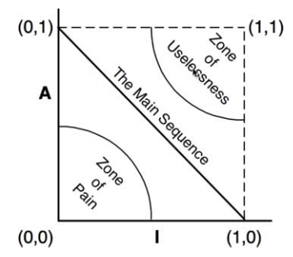

# Part IV: Component Principles

## Components

- The SOLID principles tell us how to arrange the bricks into walls and rooms, then the component principles tell us how to arrange rooms into buildings.
- Large software systems are built out of smaller components.
- Components can be thought of as units of deployment, they're the smaller entities that can be deployed as part of a system (the granule of deployment.)
- Components can be linked together into a single executable, or they can be aggregated together into a single archive (`.war` file), or they can independently deployed as separate dynamically loaded plugins (`.dll`, `.jar`, `.exe`).
- Regardless of how they're deployed, well-designed components always **retain the ability to be independently deployable and independently developable**.

### History of Components

- Lots of programs back in the day had to control memory location, one of the first lines of code in a program was often referred to as the `origin statement`. Which was essentially a line that declared which address the program would be loaded in at.
- Compiling large programs could take a long time, an approach taken to improve compile times was to separate the source code of the function library from the application and allocate an address for each.
- The problem with this was that if the space for say the function library out grew what we allocated, we need to pick a new spot which often isn't near where the rest of it is.
- This leads to having parts in memory all over the place and memory management can become a real nightmare.

#### Relocatability

- The solution for the above issue was relocatable binaries, which involved the compiler outputting binary code that could be relocated in memory by a smart loader.
- The loader would be told where to load the relocatable code.
- The relocatable code was instrumented with flags that told the loader which parts of the loaded data had to be altered to be loaded at the selected address.
- This now allowed the programmer to tell the loader where to load the function library, and where to load the application; which ultimately let the programmer to load only the functions they need.
- The compiler was also changed to emit the names of the functions as metadata in the relocatable binary.
- If a library **called** a library function, the compiler would emit that name as an **external reference**.
- If a library **defined** a library function, the compiler would emit that name as an **external definition**.
- Then the loader could link the external references to the external definitions once it had determined where it had loaded those definitions.
- This is how the **linking loader** was born.

#### Linkers

- The linking loader allowed programmers to divide their programs up onto separately compilable and loadable segments.
- When programs got bigger these linkers got too slow to tolerate.
- This lead to loading and linking being separating into 2 different phases.
  - The linker, which did the linking.
  - The output of the linker was a linked relocatable that a relocating loader could load very quickly.
- This allowed programmers to prepare an executable using the slow linker but they could load it quickly anytime.
- Eventually as time went on and computers and devices got more fast, we could do the linking at load time.
- This ultimately lead to the **plugin architecture** being born.

### Conclusion

- Dynamically linked files that can be plugged together at runtime are the software components of our architectures.
- Long ago, it wouldn't have seemed possible but now plugin architecture can be the casual default.

## Component Cohesion

- Principles of Component Cohesion:
  - **REP**: The Reuse/Release Equivalence Principle
  - **CCP**: The Common Closure Principle
  - **CRP**: The Common Reuse Principle

### The Reuse/Release Equivalence Principle

- **The granule of reuse is the granule of release**
- May seem obvious, however, people who want to reuse software components usually won't unless those components are tracked through a release process and are given release numbers.
  - This is more so because developers need to know when new releases are coming, and which changes those new releases will bring.
  - Developers need to make informed decisions as to whether they want to use the newer versions of software or if they are better off to stay with their current version.
- Software design and Architecture POV: This principle means that the classes and modules that are formed into a component must belong to a cohesive group. The component can't consist of a random hodgepodge of classes and modules, there should be some overarching theme or purpose that all the modules share.
- Classes and modules that are grouped together should be releasable together, being grouped together should make sense to both the author and user.
- The next 2 principles support this vague principle by highlighting the negative affects of breaking it.

### The Common Closure Principle

- _Gather into components those classes that change for the same reasons and at the same times. Separate into different components those classes that change at different times and for different reasons_
- This is essentially the Single Responsibility principle restated for components... a component should not have multiple reasons to change.
- If 2 components are so tightly bound (either physically or conceptually) that they always change together, then they belong in the same component.
- This minimizes the workload related to releasing, revalidating, and redeploying the software.

- This principle is tightly associated with the Open-Closed Principle in regards to closure.
- The OCP states that classes should be closed for modification but open for extension because 100% closure is not attainable, closure is strategic.
- The CCP amplifies this lesson by gathering together into the same component those classes that are closed to the same types of changes.

  - This means that when a change come along, there's a good change of it being restricted to a minimal number of components.

- SRP and CCP can be summarised with the following: _Gather together those things that change at the same times and for the same reasons. Separate those things that change at different times or for different reasons._

### The Common Reuse Principle

- _Don't force users of a component to depend on things they don't need._
- Classes and modules that tend to be reused together belong in the same component.
- In a component with such coupling, we'd expect the classes to have lots of dependencies between each other.
- The principle also tells us which classes not to keep together in a component.
- We want to make sure that the classes that we put into a component are inseparable, it is impossible to depend on some and not the others.
  - This is because we will be redeploying more components than is necessary, and wasting significant energy.
- In essence the CRP says that classes that are not tightly coupled should not be in the same component.
- The CRP is the generic version of the ISP, the ISP advises us not to depend on classes that have methods we don't use, whereas the CRP advises us not to depend on components that have classes we don't use.
- _Don't depend on things you don't need._

### Tension Diagram for Component Cohesion

The 3 cohesive principles fight each other. The REP and CCP are inclusive, making components larger. Whereas CRP is exclusive, making components smaller. Grouping components together can cause too many unneeded releases or too many components changing and splitting components to avoid unneeded releases can make components harder to reuse. An architect who just focuses on REP and CRP will find that too many components are impacted when simple changes are made. In contrast, those who focus too much CCP and REP will cause too many unneeded releases to be generated.

A good architect will strike a balance that best suits the current needs of the development team and is aware that this can change over time. Projects generally start out towards the right hand side of the triangle, where reuse is the only sacrifice aa the teams focus is developing. As the project matures and other projects begin to draw from it, we start to drift over to the left.]

### Conclusion

- In choosing the classes to group together into components, we must consider the opposing forces involved in reusability and develop-ability.
- This balance is always dynamic, what is appropriate now might not be appropriate next year.
- The composition of components will likely jitter and evolve with time as the focus of the project changes from develop-ability to reusability.

## Component Coupling

### The Acyclic Dependencies Principle

- Allow no cycles in the component dependency graph.
- Was created to address the issue of developer environments where multiple people work on the same source files and due to dependencies between files, essentially really struggling to create a stable version of the product.
- An alternative approach that had been used was the "weekly build" technique which involved developers working in isolation for the first 4 days of the week and then on Friday they all come together and integrate their changes.

  - This is approach isn't maintainable in the long run due to project growth, meaning the integration and build times will grow and the team will take a big hit in productivity and efficiency.
  - The solution to this issue is to partition the development environment into releasable components, which become units of work that can be the responsibility of a single developer, or a team.
    - This solution gives other teams who may depend on the component the option to take on the new release of a component when it comes out or to keep the current version, giving all teams flexibility.

- In order to make the above solution work you have to manage the dependency structure of the components and have no cycles.
- When you want to make a change to a component, to know which components will be effected, you need to know which components use it/depend on it.

#### Breaking the Cycle

- It's always possible to break a cycle of components and reinstate the dependency graph as a DAG.
- The 2 primary ways of doing so:
  - Apply **DIP**, create an interface in the appropriate location to break the cycle.
  - Create a new component that the 2 components causing the cycle will both depend on. Then move the classes that they both depend on into that new component.

### Top-Down Design

- The component structure can't really be designed top-down, it evolves and grows as the system does.
- It is something that has to be thought of carefully and managed as you build the system.
- If you tried to design the component dependency structure right off the bat, it'd probably go quite poorly.

### The Stable Dependencies Principles

- Depend in the direction of stability.
- Any component that is expected to be volatile should not be depended on by a component that is difficult to change.
- We ensure that modules that are intended to be easy to change are not depended on by modules that are harder to change.

#### Stability

- Stability is related to the amount of work required to make a change.
- Some things that can make a software component hard to change include its size, complexity, and clarity as examples.
- A component with lots of incoming dependencies is very stable because it requires a great deal of work to reconcile any changes with all the dependent components.
- If you take a component (say "x") that has 3 other components that depend on it. We say that x is responsible for those components. If x also does not depend on anything itself, in other words it has no external influence to make it change. We say x is **independent**.

#### Stability Metrics

- One way to measure the stability of a component is to count the number of dependencies that enter and leave the component, this will give us a **positional stability**.
- **Fan-in**: This metric identifies the number of classes outside this component that depend on classes within the component, _incoming dependencies_.
- **Fan-out**: This metric identifies the number of classes inside this component that depend on classes outside the component, _outgoing dependencies_.
- `Instability = Fan-out ÷ (Fan-in + Fan-out)`: This metric has the range [0,1].
  - `I = 0` indicates a maximally stable component, `I = 1` indicates a maximally unstable component.
- The SDP says that the I metric of a component should be larger than the I metrics of the components that it depends on.
- **I metrics should decrease in the direction of dependency**.

#### Not All Components Should Be Stable

- If all components in a system were maximally stable, the system would be unchangeable.
- We ideally want a well structured system with stable and unstable components.
  - Diagramming conventionally will have the unstable components towards the top and the stable components down the bottom.
  - If you follow this convention, any arrow pointing up violates the SDP.
- It is common for components to be intentionally unstable, when this happens it's important to be wary so that we don't accidentally make a stable component depend on it.
  - If a stable component needs something from an unstable component, we apply the DIP and create an interface.
  - Components that only contain an interface (no executable code) are what we call **Abstract Components**.
  - Note that these components only exist in statically typed languages (like Java) and don't exist in dynamically typed languages (like Python).
    - This is due to dependency structures in these languages being much simpler as dependency inversion doesn't require the declaration or inheritance of interfaces.

### The Stable Abstractions Principle

- A component should be as abstract as it is stable.
- The SAP sets up a relationship between stability and abstractness.
- If a component is to be stable, it should consist of interfaces and abstract classes so that it can be extended.
- The SAP and SDP combined create the DIP for components.

#### Where Do We Put The High Level Policy

- High-level architecture and policy decisions should not be volatile, meaning that the software that encapsulates the high-level policies of a system should be in stable components.
- However making the source code that represents the policies are difficult to change then the overall architecture could become inflexible.
- The way to do this is **Abstract Classes**, create a class that is flexible enough to be extended without requiring modification (OCP).

#### Measuring Abstraction

- The `A` metric is a measure of abstractness of a component, its value is the ratio of interfaces and abstract classes in a component to the total number of classes in the component.
- `Nc` is the number of classes in a component, and `Na` is the number of abstract classes and interfaces in the component.
- Abstractness: `A=Na÷Nc`, ranges from 0 to 1. 0 implying the component has no abstract classes at all and 1 implying the component contains nothing but abstract classes.
- Combining this metric with the I metric we used earlier, we can come up with a graph on where we should avoid.

- The more volatile a component in the Zone of Pain, the more painful it is.
- A component that sits on the Main Sequence is not too abstract for its stability and it isn't too unstable for it's abstractness.
- The most desirable positions are at either end of the Main Sequence (0,1) or (1,0). Good architects should strive for these positions.
- We can measure how far a component is from the main sequence with this: `Distance (D) = | A + I - 1 |`, this will be in the range `[0,1]`.
  - Numbers close to 1 mean it is far from the Main Sequence.
  - Numbers close to 0 mean it is near the Main Sequence.
- We can calculate the mean and variance of all the D metrics for the components within a design.
  - The variance can be used to establish "control limits", to identify what is acceptable.
  - Looking at the standard deviations from the Main Sequence, we can see what components are worth examining.

### Conclusion

- The dependency management metrics described measure the conformance of a design to a pattern of dependency and abstraction.
- Keep in mind that a metric is not a god; it is just a measurement against an arbitrary standard.
- The metrics are imperfect can be found to be useful.
