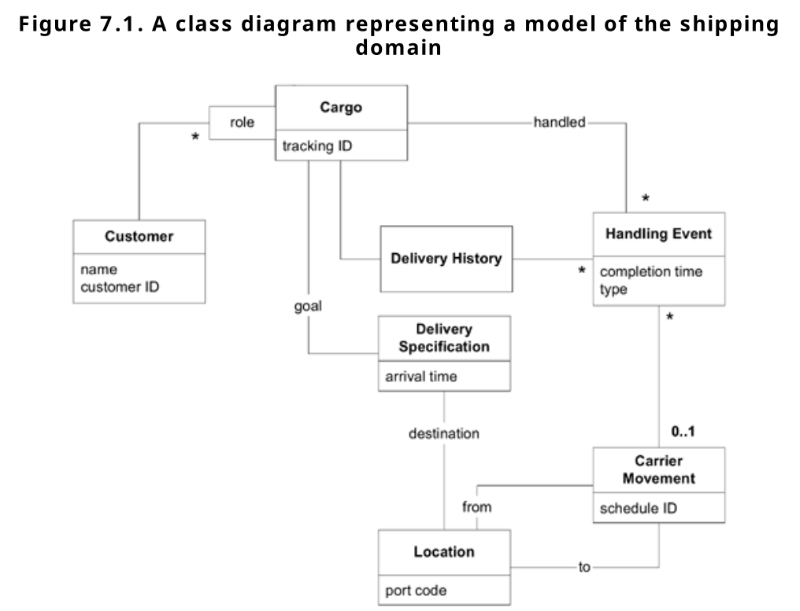
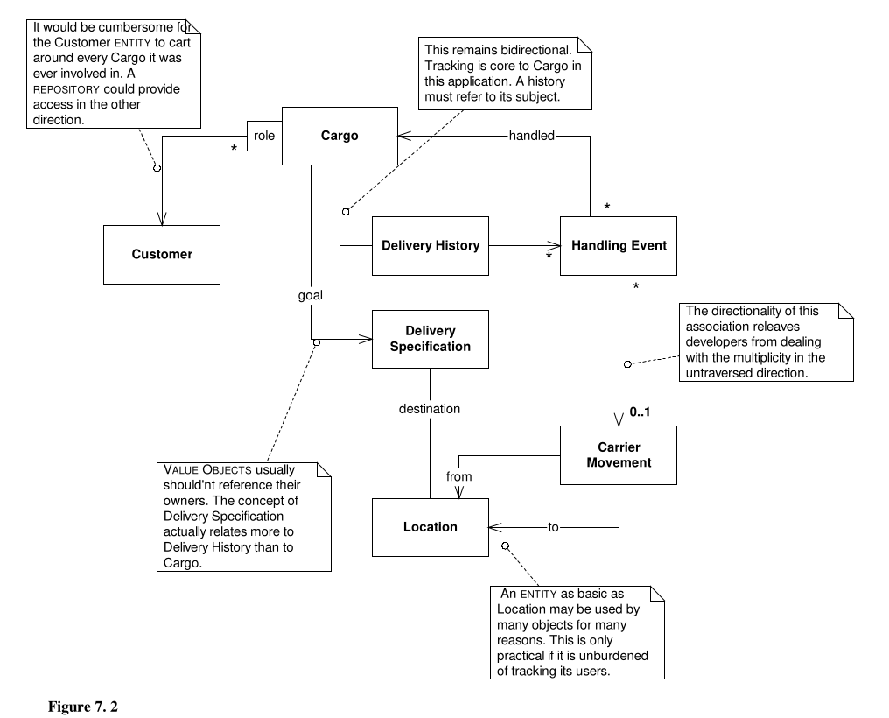
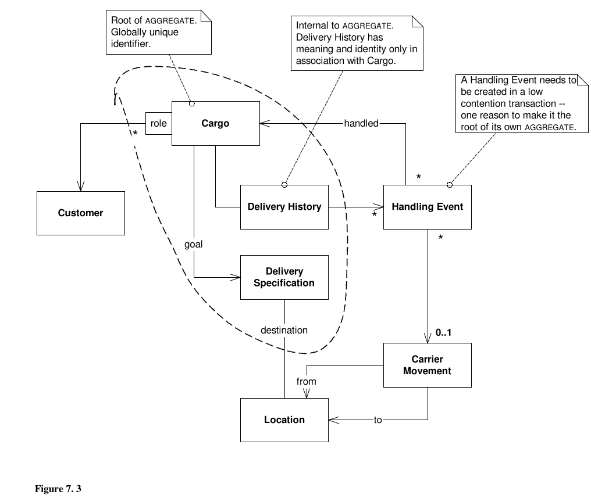
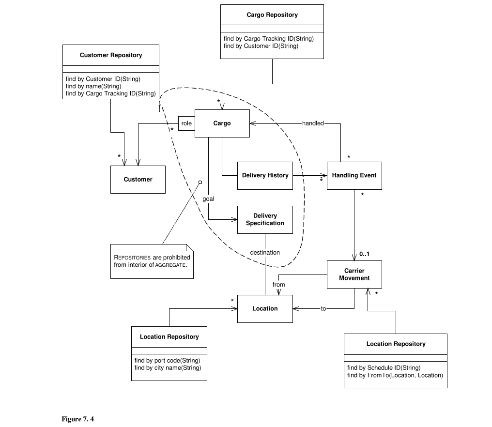
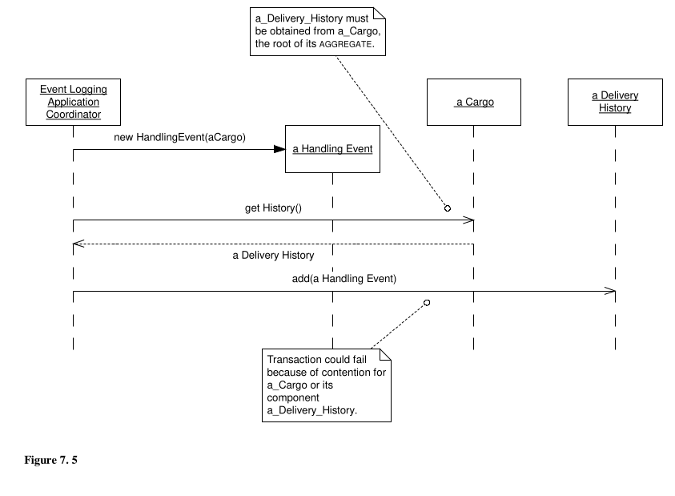
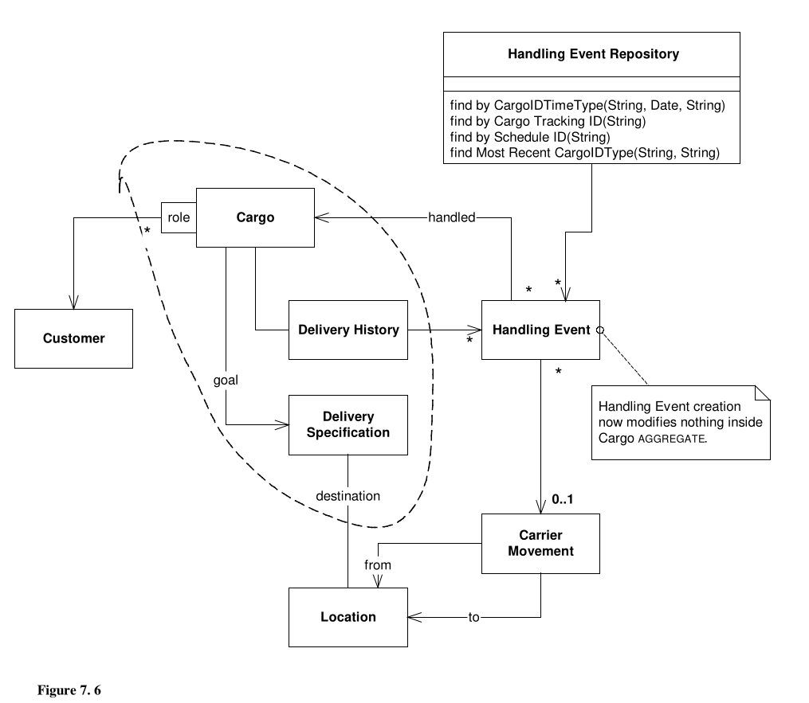

# Part II: The Building Blocks of Model-Driven Design

## Isolating the Domain

### Layered Architecture

- Layered Architecture consists of 4 conventional parts: User Interface, Application, Domain, and Infrastructure.
  - Our model lives in the domain layer.
- **UI Layer**: Responsible for showing information to the user and interpreting the user's commands.
- **Application Layer**: Defines the jobs the software is supposed to do and directs the expressive domain objects to work out problems. It doesn't contain business rules, it only coordinates tasks and delegates work to collaborations of domain objects in the next level down.
- **Domain Layer**: Responsible for representing concepts of the business, information about the business situation, and business rules. This layer is the heart of business software.
- **Infrastructure Layer**: Provides generic technical capabilities that support the higher layers, this layer may also support the pattern of interactions between the four layers through an architectural framework.

#### Relating the Layers

- _How do we connect the layers without losing the benefit of separating concerns?_ Is the driving motivation behind many design patterns.
- Architectural patterns for lower layers to connect to higher levels:
  - Callbacks
  - Observers
  - Model-View Controller (MVC) (connecting the UI to the application and domain layers)
  - Model-View Separation Pattern
  - Application Coordinator
- Any approach is fine, as long as we maintain the isolation of the domain layer.
- Infrastructure layer usually offers its capabilities through `services`.

#### Architectural Frameworks

- The best architectural frameworks solve a complex technical problem while allowing the domain dev to focus on expressing the model.
- When a applying on a framework, focus on your goal: building an implementation of a domain model and using it to solve important problems.
- Given how complicated many frameworks are to use, minimalist in framework feature application can help keep business objects/login readable and expressive.

#### Domain Layer is where the Model lives

- It is not practical to achieve that correspondence when the domain logic is mixed with other concerns of the program.

### The Smart UI Anti-Pattern

- This approach is not compatible with DDD, it involves putting all the business logic into the UI (essentially having everything in one place.)
- Advantages:
  - Productivity is high.
  - Less capable devs can work this way with little training.
  - Deficiencies in requirements analysis can be overcome by releasing a prototype to users and then quickly changing the product to fit their requests.
  - Applications are decoupled from each other, so that delivery schedules of small modules can be planned relatively accurately.
  - Relational databases work well and provide integration at the data level.
  - 4GL tools work well (MATLAB).
  - When apps are handed off, maintenance programmers will be able to quickly redo portions they can't figure out, because the effects of the changes should be localised to each particular UI.
- Disadvantages:
  - Integration of applications is difficult except through the database.
  - There is no reuse of behaviour and no abstraction of the business problem. Business rules have to be duplicated in each operation to which they apply.
  - Rapid prototyping and iteration reach a natural limit because the lack of abstraction limits refactoring options.
  - Complexity buries you quickly, so the growth path is strictly toward additional simple apps. There is no graceful path to richer behaviour.
- Only use this sort of design approach if it fits your use case perfectly, otherwise it becomes a mess.

## A Model Expressed in Software

- This chapter is all about the "how" in terms of creating the model in the code.
- The three entities that will be focused on making distinctions between are: **entities**, **value objects**, and **services**.

### Associations

- Reflecting models in code in comparison to drawing a diagram can be quite difficult.
- _For every traversable association in the model, there is a mechanism in the software with the same properties._`
- There are 3 ways of making associations more tractable:
  - Imposing a traversal direction.
  - Adding a qualifier.
  - Eliminating non-essential associations.
- It's important to create models that are specific and lack unnecessary detail, the example they use is that something can be presented as bi-directional but it makes more sense to be represented as uni-directional. This makes it more obvious for when you do see a relationship that has more meaning in terms of a bi-directional relationship. Essentially take care when showing your representations so that you can understand how the software should work on a better level.
- If a model is made well and it's relationships are accurate, the software implementation is irrelevant in the sense that if it meets the requirements of the spec, it doesn't really matter how it happens.

### Entities

- Some objects are not defined primarily by their attributes, they represent a thread of identity that runs through time and often across distinct representations.
- Sometimes such an object must be matched with another object even though attributes differ.
- An object must be distinguished from other objects even though they might have the same attributes, mistaken identity can ultimately lead to data corruption.
- An object defined primarily by its identity is an Entity.
- An Entity is anything that has continuity through a life cycle and distinctions independent of attributes that are important to the application's use.
- Not all objects in the model are entities, with meaningful identities.
- The most basic responsibility of entities is to establish continuity so that behaviour can be clear and predictable.
- Entities tend to fulfil their responsibilities by coordinating the operations of objects they own.
- An identifying attribute must be guaranteed to be unique within the system.
- It is important to have a unique identifier (usually a combination of attributes) that is relevant to the domain and guaranteed to be unique across systems.

### Value Objects

- Objects that don't have a conceptual identity but describe characteristics of something, they are instantiated to represent elements of the design that we care about only for what they are, not who or which they are.
- Tracking identity of Entities is essential, but attaching identity to other, unnecessary objects can potentially be harmful.
- An example they use in the book is children drawing, the kid doesn't care which marker he is using (ie. 2 red markers are interchangeable, kid just wants red) but a child can distinguish their own drawing from others. That is because the child along with their drawing are uniquely identifiable. If you were to ask the child for every line in the drawing, what marker he used it would be quite difficult.
- Value objects can reference entities, an example is a routing program. The route object may be a value object, but the start and destination are both entities.
- They are frequently passed in as parameters in messages between objects, usually being transient, created for an operation and then discarded.
- Value objects can give information about an entity, it should be conceptually whole.
- Defining value objects and designing them as immutable is a case of following a general rule: Avoiding unnecessary constraints in a model leaves developers free to do purely technical performance tuning.

#### Designing Associations That Involve Value Objects

- The fewer and simpler the associations in the model the better.
- Bidirectional associations between value objects doesn't make any sense, without identity it's meaningless to say that an object points back to the same value object that points to it.
- Try to completely eliminate bidirectional associations between value objects.
- If in the end such an association seems necessary rethink the decision to declare said object as a value object.

### Services

- Sometimes concepts from the domain don't make sense to be in an object, like a activity or an action, this is where services come in.
- A service is an operation offered as an interface that stands alone in the model, without encapsulating state, as entities and value objects do.
- Services are a common pattern in technical frameworks and also apply in the domain layer.
- Named as a verb rather than a noun.
- A service should have a defined responsibility, and that responsibility and the interface fulfilling it should be defined as part of the domain model.
- Operation names within the service should come from the **ubiquitous language**.
- A good service has 3 characteristics:
  - The operation relates to a domain concept that is not a natural part of an entity or value object.
  - The interface is defined in terms of other elements of the domain model.
  - The operation is stateless (meaning that a user can use any instance of a service without regard to the instance's individual history).
- When a significant process or transformation in the domain is not a natural responsibility of entity or value object, add an operation to the model as a standalone interface declared as a service.

#### Services and the Isolated Domain Layer

- This is a pattern focused on services that have an important meaning in the domain in their own right.
- Most services generally belong in the infrastructure layer, Domain and application services collaborate with these infrastructure services.
- An example of distinguishing these services is used; Take a bank that sends a notification to a user when the balance goes below a threshold.
  - The infrastructure layer service encapsulates the email system and perhaps an alternate means of notification.
  - The application layer service is responsible for ordering the notification.
  - The domain layer service is responsible for determining if a threshold was met.
- A good way to think of it is that the domain layer should contain terms that are used in the domain (ubiquitous language) and should not show up in the infrastructure layers. Technical services should lack business meaning.

#### Granularity

- This pattern is also valuable as a means of controlling granularity in the interfaces of the domain layer, as well as decoupling clients from the entities and value objects.
- Granularity refers to the breaking down of larger tasks into smaller ones.
- Fine-grained domain objects can contribute to knowledge leaks from the domain into the application layer, where the domain object's behaviour is coordinated.
- Judicious use of domain services can help maintain the bright line between layers, helping us stop different layered concerns creeping across layers.
- This pattern favours interface simplicity over client control and versatility.

#### Access to Services

- The means of providing access to a service is not as important as the design decision to carve off specific responsibilities.
- A simple **singleton** can be written easily to provide access.
  - A singleton is a design pattern which ensures that only one object of its kind exists and provides a single point of access to it for any other code.
- Coding conventions can make it clear that these objects are just delivery mechanisms for service interfaces, and not meaningful domain objects.

### Modules (Packages)

- There should be a low coupling between modules and high cohesion within them.
  - There is a limit to how many things a person can think about at once (low coupling.)
  - Incoherent fragments of ideas are as hard to understand as an undifferentiated soup of ideas (high cohesion.)
- Modules and the smaller elements should co-evolve, typically they don't though.
- Modules are chosen to organise an early form of the objects, then after that the objects tend to change in ways that keep them within the bounds of the module definition.
- Refactoring modules can be dangerous and is more difficult than refactoring classes.
- Modules are a communication mechanism, the meaning of the objects being partitioned needs to drive the choice of modules.
- If your model is telling a story, think of modules as the chapters.
- Modules and their names should reflect insight into the domain.

#### Agile Modules

- Modules should co-evolve with the code, however this often doesn't happen.
- This results in module structures and names reflecting much earlier forms of the model.
- Early mistakes in module choices lead to high coupling which make it harder to refactor.

#### Pitfalls of Infrastructure-Driven Packaging

- A useful framework standard is the enforcement of layered architecture by placing infrastructure and user interface code into separate groups of packages, leaving the domain physically separate.
- Some frameworks create tiers by spreading the responsibilities of a single domain object across multiple objects and then placing those objects in separate packages.
- An example of a fine-grained object split up into 4 tiers could looks something like this:
  - First tier: data persistence layer, handling mapping and access to a database.
  - Second tier: handles behaviour intrinsic to the objects in all situations.
  - Third tier: superimposes application-specific functionality.
  - Fourth tier: a public interface, decoupled from all the implementation below.
- Elaborate technically driven packaging schemes impose 2 costs:
  - If the framework's partitioning conventions pull apart the elements implementing the conceptual objects, the code no longer reveals the model.
  - There is only so much partitioning a mind can stitch back together, and if the framework uses it all up, the domain developers lose their ability to chunk the model into meaningful pieces.
- Keep things simple! Choose a minimum of technical partitioning rules that re essentials to the technical environment or that actually aid development.
- Keep all code that implements a single conceptual object in the same module, if not the same object.

### Modelling Paradigms

- Model-Driven Design calls for an implementation technology in tune with the particular modelling paradigm being applied.
- The dominant paradigm is **object-oriented design**.

#### Why the Object Paradigm Predominates

- Object modelling strikes a nice balance of simplicity and sophistication.
- Fundamentals of OO seem to come naturally to most people.
- It is rich enough to capture the essence of the domain model.
- Many common problems have been solved for objects.
- The developer community and design culture is also important for a modelling paradigm.

#### Non-objects in an Object World

- A domain model doesn't have to be an object model (although its the most popular and "safest").
- Model paradigms have been conceived to address certain ways people like to think about domains.
  - Then the models for those domains are shaped by the paradigm.
  - The result is a model that conforms to the paradigm so that it can be effectively implemented in the tools that support that modelling style.
- It is okay to have an ugly object if there is only a small case where one thing would suit a different paradigm.
- Alternatively if there are lots of things that suit another paradigm, it may be worth swapping.
- If there are major parts of the system both being better off with different paradigms then it's best to design them both in their own paradigms.

#### Sticking with Model-Driven Design when Mixing Paradigms

- The example the book goes through is modelling rules in your project, although you can model rules with objects there is a technology (Rules engine) that does it much better. Mixing the rules paradigm with the objects paradigm.
  - It is important to continue to think in terms of models while working with rules.
  - The goal is to find a single model that can work with both paradigms.
  - The most effective tool for holding the parts together is a robust _ubiquitous language_ that underlies the whole heterogeneous model.
- A model-driven design does not have to be object-orientated but it does depend on having an expressive implementation of the model constructs.
- Below are 4 rules of thumb for mixing non-object elements into a predominantly object-orientated system:
  1. **Don't fight the implementation paradigm.**
     - There's always another way to think about a domain.
     - Find model concepts that fit the paradigm.
  2. **Lean on the ubiquitous language.**
     - Even when there is no rigorous connection between tools, very consistent use of language can keep parts of the design from diverging.
  3. **Don't get hung up on UML.**
     - Can lead you to distort the model to make it fit what can easily be drawn.
     - Sometimes just a plain old english description is better.
  4. **Be sceptical.**
     - Is the tool I am using pulling its weight?
     - Just because you have some rules doesn't mean you need a rules engine.
     - Question these things.
     - Mixing paradigms is complicated, and if its not necessary don't do it.
- Before mixing paradigms the options within the dominant paradigm should be exhausted.

## The Life Cycle of a Domain Object

- Objects have life cycles!
  - Simple objects are simply called or used and then removed.
  - Complex objects have longer lives and go through changes of state.
- The challenges fall into 2 categories:
  - Maintaining integrity throughout the lifecycle.
  - Preventing the model from getting swamped by the complexity of managing the life cycle.

### Aggregates

### Factories

## Using the Language: An Extended Example

- Goal of this chapter is to put together the pattens we have covered, as realistically you have to juggle them all at the same time.
- The example we will be working with is a **Cargo Shipping System**.

### Initial Requirements

1. Track key handling of customer cargo.
2. Book cargo in advance.
3. Send invoices to customers automatically when the cargo reaches some point in its handling.

Obtaining these requirements involves a process of its own which is discussed in Part 3. Here we are focus on refining these to support the design.



- A _role_ distinguishes different parts played by **Customers** in a shipment.
  - You might have a shipper, receiver and a payer for example.
  - A role could be a class if more behaviour is needed, but if not a simple string would suffice.
- This diagram organises domain knowledge and provides a language for the team:
  - Multiple **Customers** are involved with a **Cargo**, each playing a different role.
  - The **Cargo** delivery goal is specified.
  - A series of **Carrier Movements** satisfying the **Specification** will fulfil the delivery goal.
- The **Handling Event** is a discrete action with the **Cargo**, this class would probably be elaborated into a hierarchy of different kinds of events: loading, unloading, or being claimed, as examples.
- The **Delivery Specification** defines a delivery goal, which follows the _SPECIFICATION_ pattern which is broken down in Chapter 9.
  - _"In computer programming, the specification pattern is a particular software design pattern, whereby business rules can be recombined by chaining the business rules together using boolean logic." - Wikipedia_
  - The **Delivery Specification** could of been a responsibility of **Cargo**, however we get 3 main advantages from abstracting it out:
    - Without Delivery Specification, the Cargo object would be responsible for the detailed meaning of all those attributes and associations for specifying the delivery goal, cluttering up **Cargo** and making it harder to change.
    - Makes it easy and safe to suppress detail when explaining the model. What is meant by this is that at a higher level, all that's important is to know that there is a delivery specification and that the details of it can be changed if needed.
    - This model is more expressive. Adding **Delivery Specification** says explicitly that the exact means of delivery of the **Cargo** is undetermined, but it must accomplish the goal set out in the **Delivery Specification**
- **Carrier Movements** represents one particular trip by a particular **Carrier** (like a truck or a ship) from one **Location** to another.
- **Cargo** can ride from place to place by being loaded onto **Carriers** for the duration of one or more **Carrier Movements**.
- **Delivery History** reflects what has happened to **Cargo**.
  - It can compute the current **Location** of the **Cargo** by analysing the last load or unload and the destination of the corresponding **Carrier Movement**.
- A successfully delivery will have a **Delivery History** that satisfied the goals of the **Delivery Specification**.

In order to frame up a solid implementation, this model still needs some clarification and tightening. We are starting with a more mature model then what you normally would start with and changes will be motivated strictly by the need to connect the model with a practical implementation, employing the building block patterns.

### Isolating the Domain: Introducing the Applications

Here we apply _LAYERED ARCHITECTURE_ to ensure that domain responsibilities don't get mixed in with those of other parts of the system.  
We can identify 3 user-level application functions, which we can assign to 3 application layer classes:

1. A **Tracking Query** that can access past and present handling of a particular **Cargo**.
2. A **Booking Application** that allows a new **Cargo** to be registered and prepares the system for it.
3. An **Incident Logging Application** that can record each handling of the **Cargo** (providing the information that is found by the **Tracking Query**.)

These _application classes_ are coordinates, they should not work out the answers, that's the domain layers job. An example of this would be our Connect4 application. The application layer or in our case the UI layer might ask how do I make move? But all the logic to actually make the move is in the domain, which we can interact with via in interface.

### Distinguishing Entities and Value Objects

#### Customer

- A **Customer** object represents a person or a company.
- It has identity that matters to the user, thus making it an **ENTITY** in the model.
- How can we track it? This question usually calls for consultation with a domain expert.
  - Let's say for example, after consultation, that every **Customer** is already stored in a database with a unique ID.

#### Cargo

- 2 identical crates must be distinguishable, so **Cargo** objects are **ENTITIES**.
- In practice, all shipping companies assign tracking IDs to each piece of cargo.
- This ID will be automatically generated, visible to the user, and probably conveyed to the customer at booking time (in this case).

#### Handling Event & Carrier Movement

- We care about individual incidents so that we can track what is going on.
- They reflect real-world events which are not usually interchangeable, so they are **ENTITIES**.
- Each **Carrier Movement** will be identified by a code obtained from a shipping schedule.
- After another discussion with a domain expert, we find out that **Handling Events** can be uniquely identified by the combination of **Cargo** ID, completion time, and type (For example, the same **Cargo** can't be loaded and unloaded at the same time).

#### Location

- Will be part of a geographical model of some kind that will relate places according to shipping lanes and other domain-specific concerns.
- Meaning an arbitrary, internal, automatically generated identifier will suffice.
- Trying to use longitude or latitude as an identifier would indeed be unique but isn't very practical since those measurements are not of interest to most purposes of the system.

#### Delivery History

- **Delivery Histories** are not interchangeable, so they are **ENTITIES**.
- A **Delivery History** also has a 1:1 relationship with its **Cargo**.
- It doesn't really have an identity of its own, its identity is borrowed from the **Cargo** that owns it.
- This relationship will be more clear when we model our **AGGREGATES**.

#### Delivery Specification

- **Delivery Specifications** are **VALUE OBJECTS**.
- Although it represents the goal of a **Cargo**, this abstraction doesn't depend on **Cargo**.
- It really expresses some hypothetical state of some **Delivery History**.
- We hope that the **Delivery History** attached to our **Cargo** will eventually satisfy the **Delivery Specification** attached to our **Cargo**.

#### Role and Other Attributes

- Role says something about the association it qualifies, but it has no history or continuity.
- It is a **VALUE OBJECT** and can be shared among different **Cargo**/**Customer** associations.
- Other attributes like time stamps or names are **VALUE OBJECTS**.

### Designing Associations in the Shipping Domain

- Bidirectional associations can be problematic in a design.
- Traversal direction often captures insight into the domain, depending on the model.
- Take a **Customer** for example:
  - The concept of a **Customer** is not specific to **Cargo**.
  - If the **Customer** has a direct a reference to every **Cargo** it has shipped, it will become cumbersome for long-term, repeat **Customers**.
  - In a large system, the **Customer** may have roles to play with many objects, so probably best to keep it free of such specific responsibilities.
  - If we need to find **Cargoes** by **Customer**, this can be done through a database query.
- If our application were tracking the inventory of ships, traversal from **Carrier Movement** to **Handling Event** would be important.
  - Since we only need to track **Cargo**, making the association traversable only from **Handling Event** to **Carrier Movement** captures that understanding of our business.
  - This also reduces the implementation to a simple object reference, because the direction with multiplicity was disallowed.



- There is 1 circular reference in our model: **Cargo** knows its **Delivery History**, which holds a series of **Handling Events**, which in turn point back to the **Cargo**.
- We could either:
  - Give **Delivery History** a List object containing **Handling Events**.
  - Use a database with database lookups using **Cargo** as the key.
- Some things to consider is how frequent such a look up would be needed, trading off between simplicity of implementation against performance.

### Aggregate Boundaries

- **Customer**, **Location**, and **Carrier Movements** have their own identities and are shared by many **Cargoes**, meaning they must be the roots of their own **AGGREGATES**.
- These **AGGREGATES** would contain their own attributes and possibly other objects below the level of detail of this discussion.
- **Cargo** itself is also an **AGGREGATE** root, which may seem obvious, however its boundary is what requires thinking.
- The **Delivery History** makes sense to have inside the **Cargo** **AGGREGATE** seeing as a **Delivery History** can't exist without a **Cargo**.
- The **Delivery Specification** is just a **VALUE OBJECT** so there is no complication from including it in the **Cargo** **AGGREGATE**.
- The **Handling Event** is different:
  - There are 2 possible database queries that we could perform:
    1. Find **Handling Events** for a **Delivery History** as a possible alternative to the collection, which would be local within the **Cargo** **AGGREGATE**.
    2. Find all the operations to load and prepare for a particular **Carrier Movement**, which in this case it seems that the activity of handling the **Cargo** has some meaning even when considered apart from the **Cargo** itself.
  - Taking this into consideration the **Handling Event** should be the root of its own **AGGREGATE**.



### Selecting REPOSITORIES

- We have 5 AGGREGATE roots, we will limit our consideration to these, seeing as none of the other objects are allowed to have REPOSITORIES.
- Now we don't just give it a REPOSITORY because it's an AGGREGATE root, we need to think about whether it actually needs one.
- To make this decision it is always useful to go back to the requirements:
  - To take a booking through the **Booking Application**, the user needs to select the **Customer(s)** playing the various roles (shipper, receiver, etc.).
    - We need a **Customer Repository**
  - We also need to find a **Location** to specify as the destination for the **Cargo**.
    - We can make a **Location Repository**.
  - The **Activity Logging Application** needs to allow the user to look up the **Carrier Movement** that a **Cargo** is being loaded onto.
    - We need a **Carrier Movement Repository**.
  - This user must also tell the system which **Cargo** has been loaded.
    - We need a **Cargo Repository**.



- It was decided to implement the association with **Delivery History** as a collection in the first iteration, and we have no application requirement to find out what has been loaded onto a **Carrier Movement**.
- If either of these reasons changed, we'd need a REPOSITORY.

### Walking Through Scenarios

- In order to feel confident with our decisions, it can really help to constantly step through scenarios to confirm that our decisions will solve our application problems effectively.

#### Sample Application Feature: Changing the Destination of a Cargo

- Occasionally a **Customer** calls up and says, "Oh no! We said to send our cargo to Hackensack, but we really need it in Hoboken."
- We are here to serve, so the system is required to provide for this change.
- **Delivery Specification** is a VALUE OBJECT, so it would be simplest to just throw it away and get a new one, then use a setter method on **Cargo** to replace the old one with the new one.

#### Sample Application Feature: Repeat Business

- User want to use old **Cargoes** as prototypes for new ones.
- The application will allow them to find a **Cargo** in the REPOSITORY and then select a command to create a new **Cargo** based on the selected one.
- We'll design this using the _PROTOTYPE_ pattern.
  - _A creational design pattern in software development. It is used when the types of objects to create is determined by a prototypical instance, which is cloned to produce new objects. - Wikipedia_
- **Cargo** is an ENTITY and is the root of an AGGREGATE. Therefore, it must be copied carefully.
  - You need to decide about what should happen to each object or attribute enclosed by the AGGREGATE boundary.
  - Let's go over each one:
    - **Delivery History**: We should create a new, empty one, because the history of the old one doesn't apply. This is usually the case with ENTITIES inside an AGGREGATE boundary.
    - **Customer Roles**: We should copy the Map that holds the keyed references to **Customers**, including the keys, because they are likely to play the same roles in the new shipment. CAREFUL, not to copy **Customer** objects themselves. We must end up with references to the same **Customer** objects as the old **Cargo** object referenced, because they are ENTITIES outside the AGGREGATE boundary.
    - **Tracking ID**: We must provide a new **Tracking ID** from the same source as we would when creating a new **Cargo** from scratch.
  - NOTICE: we have copied everything inside the **Cargo** AGGREGATE boundary, we have made some modifications to the copy, but we have _affected nothing outside the AGGREGATE boundary_ at all.

### Object Creation

#### FACTORIES and Constructors for Cargo

- We would like the constructor to produce an object that fulfils its invariants or at least, in the case of an ENTITY, has its identity intact.
- We could create a FACTORY in a couple of ways.
  - `public Cargo copyPrototype(String newTrackingID)` - FACTORY method
  - `public Cargo newCargo(Cargo prototype, String newTrackingID)` - standalone FACTORY method
- A standalone FACTORY could also encapsulate the process of obtaining a new ID for a new Cargo, in which case it'd become `public Cargo newCargo(Cargo prototype)`.
- Either way we'd get back a **Cargo** with an empty **Delivery History**, and a null **Delivery Specification**.
- The 2-way association between a **Cargo** and **Delivery History** means that neither are complete without the other, so they must be created together.
  - Key thing to remember is that **Cargo** is the root to the aggregate which contains both.

```java
public Cargo(String id) {
  trackingID = id;
  deliveryHistory = new DeliveryHistory(this);
  customerRoles = new HashMap();
}
```

#### Adding a Handling Event

- Each time the cargo is handled in the real world, some user will enter a **Handling Event** using the **Incident Logging Application**.
- Because the **Handling Event** is an ENTITY, all attributes that define its identity must be passed to the constructor.
  - It is identified by the combination of the ID of its **Cargo**, the completion time, and the event type.
  - It's only other attribute is the association to a **Carrier Movement**, which some types of **Handling Events** don't have.

```java
public HandlingEvent(Cargo c, String eventType, Date timeStamp) {
  handled = c;
  type = eventType;
  completionTime = timeStamp;
}
```

- Non-identifying attributes of an ENTITY can usually be added later.
- It could be convenient to add a FACTORY METHOD to **Handling Event** for each event type, taking all the necessary arguments.

```java
// handling event for loading
public static HandlingEvent newLoading(Cargo c, CarrierMovement loadedOnto, Date timeStamp) {
  HandlingEvent result = new HandlingEvent(c, LOADING_EVENT, timeStamp);
  result.setCarrierMovement(loadedOnto);
  return result;
}
```

- The **Handling Event** in the model is an abstraction that might encapsulate a variety of specialised **Handling Event** classes (loading, unloading, etc.)
- By adding FACTORY METHODS to the base class (**Handling Event**) for each type, instance creation is abstracted, freeing the client from knowledge of the implementation.
- The FACTORY is responsible for knowing what class was to be instantiated and how it should be initialised.
- The cycle of references makes this complicated, **Cargo** to **Delivery History** to **History Event** and back to **Cargo**.
  - The **Delivery History** holds a collection of **Handling Events** relevant to its **Cargo**, and the new object must be added to this collection as part of the transaction.
  - If this back-pointer were not created, the objects would be inconsistent.
- Creation of the back-pointer could be encapsulated in the FACTORY (and kept in the domain layer where it belongs).
- Next we will look at an alternative design that eliminates this awkward interaction altogether.



### Pause for Refactoring: An Alternative Design of the Cargo AGGREGATE

- Modelling and Design are not a straight forward process, you must stop and take advantage of new insights for refactors.
- An example of this in our current design is our need to update **Delivery History** when adding a **Handling Event** gets the **Cargo** AGGREGATE involved in the transaction.
  - If another user is modifying **Cargo** at the same time it could lead to the **Handling Event** transaction failing or being delayed.
  - Entering a **Handling Event** is an operational activity that needs to be quick and simple without contention.
  - Replacing **Delivery History's** collection of **Handling Events** with a query would allow **Handling Events** to be added without raising integrity issues outside of its own AGGREGATE.
  - To take responsibility for the queries we will add a REPOSITORY, **Handling Event Repository**.
- This new implementation essentially erases the need for a **Delivery History**, since it can be recreated whenever needed with a query from **Handling Event**.
  - This simplifies the **Cargo** class as well as now it no longer needs a **Delivery History** instantiated within it.



- The main point here is that there are all kinds of trade-offs everywhere, they are degrees of freedom within the same model.
- By modelling VALUES, ENTITIES, and their AGGREGATES, we have reduced the impact of such design changes.
